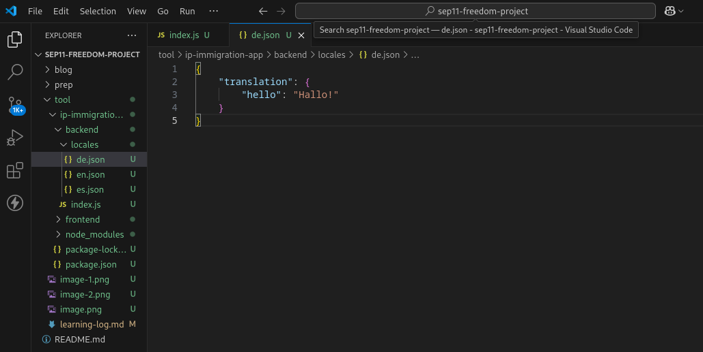
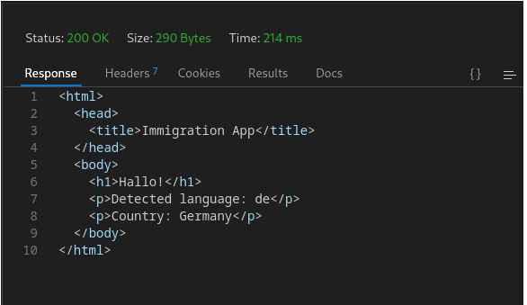
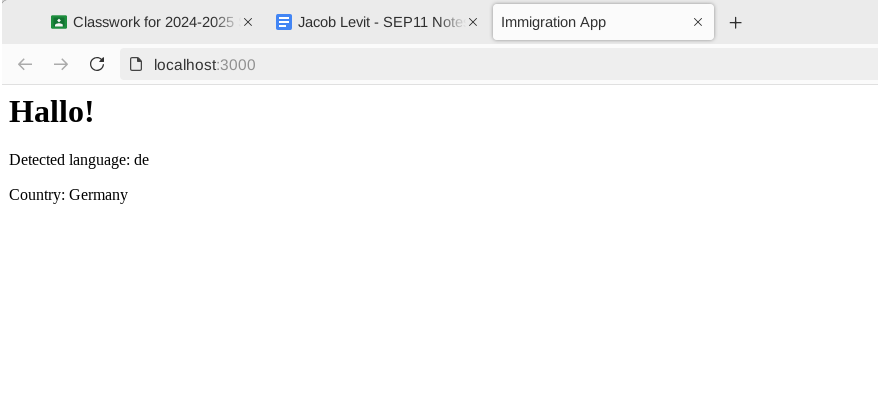
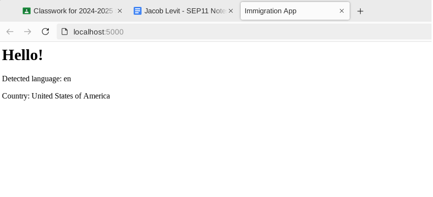

# Entry 3
##### 3/13/2025

### Content
I scrapped my pagepress multi-language route setup and created a new express repository that only uses vanilla i18n.

```bash
npm install i18n-next
```
and

```bash
npm install i18n-next-http-middleware
```

This automatically setup my app repository --which already had node dependencies which later allowed for express dependencies which depended on node to be installed-- with all of the required dependencies within the package.json file for the internationalization feature to work.

```json
{
  "dependencies": {
    "express": "^4.21.2",
    "i18next": "^24.2.2",
    "i18next-http-middleware": "^3.7.1"
  },
  "name": "ip-immigration-app",
  "version": "1.0.0",
  "main": "index.js",
  "scripts": {
    "test": "echo \"Error: no test specified\" && exit 1"
  },
  "author": "",
  "license": "ISC",
  "description": "",
}
```

I learned how to utilize [middleware](https://www.youtube.com/watch?v=lY6icfhap2o) in my express app, which is just any code that runs between the time the request is received by the server and the time the server sends out a response to the client, allowing the request and, in most cases, interdependently, the response, to be altered in that period of time.

After that I had to import all of the dependencies from the package.json file into my index.js app file,

```js
import express from "express"
import i18next from "i18next"
import middleware from "i18next-http-middleware"
import fs from "fs"
import path from "path"
import { fileURLToPath } from "url"
```
Select and store my index.js file for my backend API in a variable named ```__filename```,

```js
const __filename = fileURLToPath(import.meta.url)
```

store the directory-path to the index.js file assigned to its respective variable in another variable (```__dirname```),

```js
const __dirname = path.dirname(__filename)
```

and then create a ```localesDir``` variable which stores the combined path of the directory (__dirname) and the locales directory within the same backend folder that has each language.json file (i.e: de.json, en.json...) which dynamically sets the countryCode parameter of the geoLocation parameter (stored for readability within the ```data``` variable later in the code) of the ```req``` object to a different region, middleware allowing for that code to be run before the server sends the client back a response (```res```), which subsequently alters the request so that the corresponding response is sent back to the user depending on the data being used to alter the request, which in this case, though for now only simulated with a manually inputted ip-address, depends on data derived from the user when they request the web application from the server upon their computer trying to fetch and load the data from the website.

```js
const localesDir = path.join(__dirname, "locales")
```

Each corresponding language which the text is ultimately translated to is stored within a JSON (javascript object notation) object-string which is updated to the value of the parameters of the ```req``` object and then retroactively inserted within the html of the file with data updated based on previous functions which derive the translated text from the .json language file to use (en.json, es.json, de.json, etc., etc.,). These files are kept in a ```locales``` directory within the backend directory to be accessible when the application is hosted locally with only the data from the backend directory being accessed and processed.



I learned about manipulating data in JSON files using Javascript by watching [this video](https://www.youtube.com/watch?v=r4MLHHLctKw). JSON is used to exchange data between applications and servers.

The next step is to declare the app as express *after* the above lines of code to import all of the dependencies and select and join the file-path directories.

```js
const app = express()
```

Every region must be stored as a value within an array in javascript, with each string value for the language corresponding to the according "locale".json file.

```js
const languages = ["en", "es", "de"]
```

I had to create an empty ```resources``` object to store all of the data from the language files in the locales directory

```js
const resources = {}
```

A ```.forEach``` loop is needed to append each language from the ```locales``` directory to the ```resources``` object.

```js
languages.forEach((lang) => {
  const filePath = path.join(localesDir, `${lang}.json`)
  const content = fs.readFileSync(filePath, "utf8")
  resources[lang] = JSON.parse(content)
});
```

Then i18next must be configured by adding the resources object to it which has each of its values retroactively appended with the ```.forEach``` loop.

```js
i18next.use(middleware.LanguageDetector).init({
  preload: ["en", "es", "de"],
  fallbackLng: "en",
  resources,
});
```

And then we must add the i18next middleware to the express server.

```js
app.use(
  middleware.handle(i18next, {
    removeLngFromUrl: false,
  })
);
```

In the following app.use async/await function for adding the region language code detector middleware to the express server, we must first manually set a hardcoded ip-address for testing on the localhost computer server which does not connect to the internet and can not query dynamic ip-addresses.

```js
const ip = "101.33.11.255"
```

Next, there is code to check if the ip address is localhost (127.0.0.1) in which the calling of the ip-address api is skipped by calling the next() function after ```return``` to skip the middleware.

```js
if (ip === "127.0.0.1" || ip === "::1") {
    return next()
}
```

Then we make a call to the freeipapi.com ip-address JSON API, storing it within the ```apiUrl``` variable which is then stored within the response variable which fetches ```apiUrl``` and then uses ```await``` to only fetch this data once the other middleware finishes running.

```js
const apiUrl = `https://freeipapi.com/api/json/${ip}`;
const response = await fetch(apiUrl)
```

If the API call fails, meaning that the response is not equal to .ok (coded in the syntax !response.ok) then we throw a new a error which sends the message:

```js
`API responded with status ${response.status}`
```

The ```${response.status}``` JSON object being equal to the status of the response (200: ok, 400: server-error, etc.).

```js
if (!response.ok) {
    throw new Error(`API responded with status ${response.status}`)
}
```

[This video](https://www.youtube.com/watch?v=37vxWr0WgQk) goes over using express js to ```fetch()``` data from APIs linked within the parenthesis of the global function. It also thaught me how to utilize the ```try``` and ```catch``` blocks within the ```app.use``` ```async/await``` function for my application.

Specifically at around (5:45) timestamp it goes into depth on this line of code within my app.

```js
if (!response.ok) {
    throw new Error(`API responded with status ${response.status}`)
}
```

Which checks if the response, (the user's ip address), is ok, meaning that the get request worked and the object returned with an ok status (200-299) whereas this response is intended to be triggered if there is an error getting the ```req``` object which stores the user's ip address, either a client side error (400-499) or server side error, in the case that the freeipapi website's servers were down (500-599).

The next step is to store the response variable with the freeipapi.com API in a separate variable (data) which converts response to JavaScript Object Notation (JSON).

```js
const data = await response.json()
```

Then we set the ```.geoLocation``` property of the ```req``` object to the ```data``` variable with the value of ```response.json()``` which uses ```await``` to ensure it only runs after the other middleware (so that the code waits for the server to finish parsing the request user-data before altering that data to produce a subsequently altered response).

```js
req.geoLocation = data
```

And then create an object with references to the language code of each JSON file in the locales directory, using built-in JSON and i18n syntax to assign each lowercase string language file "en, es and de" to their respective JSON, node.js i18n capital-case country code.

```js
const countryToLanguage = {
    US: "en",
    ES: "es",
    DE: "de",
}
```

The below code checks if there even is a country code and detected language in which it sets the language code of the ```req``` object to the given language of the region by calling the rough geolocation with which the .countryCode property appended it to, constitutes a given region which then has the language that is ultimately being derived to set req.language to, as objects and arrays in Javascript have pre built functions behind them that allow them to select other objects, strings or variables, passing them through and checking those values with ones within the object or array to derive a single value to be used.

```js
if (data.countryCode && countryToLanguage[data.countryCode]) {
    req.language = countryToLanguage[data.countryCode]
    req.i18n.changeLanguage(req.language)
}
```

```js
req.i18n.changeLanguage(req.language)
```

The ```.changeLanguage``` method of the i18n ```req``` object property acts as a function which takes in the the ```req.langauge``` variable/recently-altered-object-property as the argument for the behind-the-scenes built in i18n-internationalization function to set the language to that of the ```req.langauge``` variable which retroactively depends on the user's ip-address and subsequent region.

It is important to remember to call the ```next()``` function afterward to end this middleware which get's the user's ip address, (checked with running servers provided via the freeipapi-API) converts it to a JSON object and stores that within the global ```data``` variable which the the ```.geoLocation``` parameter of the ```req``` object (```req.geoLocation```) is set to; utilizing that and the ```countryToLanguage``` object to derive the request-object language and use the ```.changeLanguage()``` method to change the language of the dynamically-updated i18n JSON object-strings according to the given language.

```js
next()
```

The code to detect the user's ip-address, derive the region, and set the according language must stop running before the code in the ```catch``` block runs to catch any rejected values when the code nested within the ```try``` block is run, and run in the console that there was an error detecting the user's location.

```js
catch (error) {
    console.error("Error detecting location:", error.message)
    next()
}
```

That middleware also has to be resolved with the ```next()``` function called after that code to ```console.error``` the error message.

I learned more about ```async/await``` with [the following video](https://www.youtube.com/watch?v=9j1dZwFEJ-c). ```Await``` works hand-in-hand with functions (such as app.use in this case) which are declared, or have their middleware (the (```req```, ```res```, and optional, but in the case of running middleware code, necessary ```next```) object parameters) declared with ```async```. Declaring ```await``` before a line of code nested within an ```async``` (asynchronous) function ensures that it is only run when a promise is met, *a-waiting* until then.

Fully formatted app.get function for getting the user's ip address and setting the language according to their region:

```js
app.use(async (req, res, next) => {
    try {
        const ip = "45.14.233.209"

        if (ip === "127.0.0.1" || ip === "::1") {
            return next()
        }

        const apiUrl = `https://freeipapi.com/api/json/${ip}`
        const response = await fetch(apiUrl)
        if (!response.ok) {
            throw new Error(`API responded with status ${response.status}`)
        }
        const data = await response.json()
        req.geoLocation = data

        const countryToLanguage = {
            US: "en",
            ES: "es",
            DE: "de",
        }

        if (data.countryCode && countryToLanguage[data.countryCode]) {
            req.language = countryToLanguage[data.countryCode]
            req.i18n.changeLanguage(req.language)
        }
        next()
    } catch (error) {
        console.error("Error detecting location:", error.message)
        next()
    }
})
```

Lastly the application must send a **response** back to the user in the form an html page with the dynamically updated req body objects whose values are derived from the previous code,

```js
app.get("/", (req, res) => {
    const welcomeMessage = req.t("hello")
    res.send(`
        <html>
            <head>
                <title>Immigration App</title>
            </head>
            <body>
                <h1>${welcomeMessage}</h1>
                <p>Detected language: ${req.language || "Not detected"}</p>
                <p>Country: ${req.geoLocation?.countryName || "Unknown"}</p>
            </body>
        </html>
    `)
})
```

The ```welcomeMessage``` gets dynamically updated with the value of the request message which has that text translated (in this case just "hello") to the translation or .t(), a nodejs and specifically i18n method that can be applied to the request object with that text passed through which is crossed referenced to the exact same text in the JSON file that the previous code determines to use, ```"translation"``` being a global operator / method in node.js, i18n and JSON, which is called with req.t().

```json
{
    "translation": {
        "hello": "Hallo!"
    }
}
```

```js
const welcomeMessage = req.t("hello");
```

For simplicity I coded the html directly in my Javascript-express file, but I must learn a templating language to connect an html file with my content, css, and frontend user-interactivity Javascript once I have my site hosted in which it will have connection to the internet and dynamically updated ip-addresses (meaning I have to change the code to not hard code it but use the req.ip object-property) instead of being hosted locally on my computer or on the cs50 github IDE port.

Since I am building the application locally using vs code and uploading a compressed .zip file of my tool folder to my IDE which I then unzip after deleting the previous directory, the port that the application listens to must be declared at the very end of the file.

```js
app.listen(5000)
```

Thunder client produces a response when a GET request is made on the localhost port with the exact same raw html which is nested within the response of the app.get route, just with the values updated.



The last ```app.get()``` operator is a route and not just a function since it has the ```"/"```, directory before the ```(req, res)``` object parameters, so in this case the app will direct to "localhost:5000", or whatever port the app is set to listen for, and produce a response with that html when the application is run (```node .``` runs all files; ```node index.js``` just runs the ```index.js``` file).

Webpage with Germany ip address applied:



Webpage with United States ip address applied:




### EDP
With that I have the entire backend for my application essentially complete.

```js
const ip = "45.14.233.209"
```

This line of code currently hard-sets the ip address to be used by the function to derive the region and language, but ***once I have my application hosted on a website with servers which have access to the internet*** I will have to change the ```ip`` variable to:

```js
const ip = req.ip
```

In order to retrieve the dynamically updated ```.ip``` property of the request object holding all of the user's data including the ip address within the ```.ip``` property.

I might also have to alter or remove this code:

```js
if (ip === "127.0.0.1" || ip === "::1") {
    return next()
}
```

My partner for the freedom project is also to design the webpage which the backend that I made will be connected to.

My next plan in learning node and express.js is to learn a templating language to apply my code to my html frontend, and after that learn how to host my website and set everything up with the backend index.js file and  frontend index.html file in their respective directories within the entire ```ip-immigration-app```.

### Skills
One skill that I strengthened throughout working on my freedom project was **problem decomposition**. I took what seemed an arduous task of creating an entire app that gets the user's ip address into a manageable 85-line javascript algorithm which takes in a hardcoded ip-address value and cross references it with real ip-addresses by ```fetching()``` data from the freeipapi.com API which has running servers which connect to the internet and can return the needed data to cross references the ip address inputted into the ```ip``` variable

```js
const apiUrl = `https://freeipapi.com/api/json/${ip}`;
```

Which is why that precisely-named variable is passed within the curly braces of the url.

Another skill that I had to practice was how to **learn on my own** as I had no idea how to use node and express to put together applications with javascript before working on my freedom project. I followed along with these videos, asking for help in coding club when need be but throughout most of the process of building the freedom project, endeavored in learning the concepts and trying it out on my own. In this case it wasn't really essential to dance around other concepts of node.js and express themselves like POST API's (which aren't even, as I assumed, utilized within my app since the data that is utilized to alter the request which is printed to the html as a JSON string is derived from the separate, freeipapi.com API) and instead *delve into achieving the goal of my project itself even despite how little I may now at the time*, in which I will learn the concepts and *how to utilize* them along the way, the only way to learn being *through actually coding the program/operation that you are envisioning*. This makes it so that after learning more coding concepts, even more ideas for apps will come to you in the future and you will know how to better implement your ideas into a working product.


[Previous](entry02.md) | [Next](entry04.md)

[Home](../README.md)
