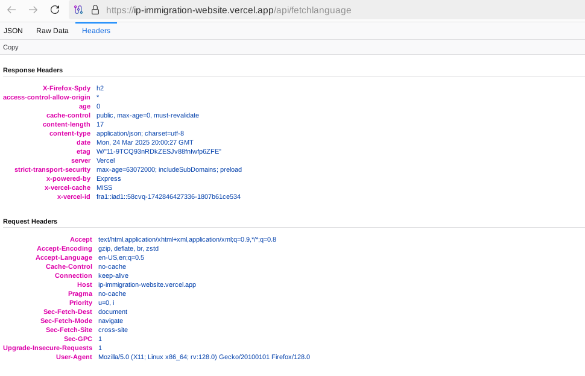

# Entry 4
##### 4/28/25

### Building My Freedom Project

* I made a new repository for the freedom project named `ip-immigration-website` which is for convenience and best practices, separate from the sep11-freedom-project repo.
    * This was due to us having to make a new repo from scratch for the app/website once again as my partner had been learning react so we had to incorporate the required dependencies for react and express and i18next into our app, and also to not have to remove anything else in the old `ip-immigration-app` app-directory (which is in the tool folder of the sep11-freedom-project repo) that may have caused the new fullstack setup to not work.
* We had to install dependencies like [cors](https://expressjs.com/en/resources/middleware/cors.html) which allows for my nodejs+express backend to be linked to my partner's react frontend.

```bash
npm install cors
```

and `dotenv`

```bash
npm install dotenv
```

* As well as the `i18next` and `i18next-http-middleware` dependencies which the freedom project already relied on for translation with node.js solely.

* [This article]("https://www.stackhawk.com/blog/react-cors-guide-what-it-is-and-how-to-enable-it/") goes into depth on `cors`, which stands for cross-origin resource sharing.

* The `back-end` package.json file at this point contained the following dependencies:

```json
{
    "dependencies": {
        "cors": "^2.8.5",
        "dotenv": "^16.4.7",
        "express": "^4.21.2",
        "i18next": "^24.2.2",
        "i18next-http-middleware": "^3.7.1"
    },
}
```

* Next we have to import the `express` and `cors` dependencies into our `index.js` file in our back-end like so:

```js
import express from "express"
import cors from "cors"
```

* I have that file stored in a folder named `api` as the index.js file acts as it's own API when called by this line of code in the front-end `initI18n.js` file, and also when the hosted vercel application is run `"https://ip-immigration-website.vercel.app/api/fetchlanguage"` (**but this only works if the `backend` directory is selected when hosting the app):

```js
const response = await fetch("http://localhost:3000/api/fetchlanguage")
```

-The `api/fetchlanguage` route leading to a response with the JSON data of the two-letter country code.

* Then the app is set to `express()` as usual.

```js
const app = express()
```

* But we also must create an `app.use()` function to use the `cors` cross-origin resource sharing dependency:

```js
app.use(cors())
```

* The following `app.get()` function produces a response using the specified request parameter (the ip address) which has the two-letter country-code (which is to later match a .json file in the locales directory in the front-end) that can be correlated to an existing language for the app to pick amongst when translating itself as that .json language file becomes added to the i18next resource bundle.

```js
app.get("/api/fetchlanguage", async (req, res) => {})
```

* We can view this pure JSON API response by visiting the "/api/fetchlanguage" directory route endpoint by simply adding that endpoint route to the end of our URL that points to the backend directory of our app hosted on vercel (need to make sure to select the backend to host).


```js
const ip = req.headers["x-forwarded-for"]
```

* This variable stores the dynamically updated ip address in the `ip` variable, and we use `req.headers["x-forwarded-for"]` which looks for the ip address in the request headers. The user's ip address connecting to the server is marked under the name `"x-forwarded-for"`, it just isn't shown in the displayed headers, but this is similar to the `x-powered-by` and `x-vercel-cache` request headers; the `"X-"` prefix present in every header which provide vendor-specific (in this case vercel) information not universally accessible by http, and/or custom information specific to the api (the client's ip address), which must be differentiated from the standard http headers to avoid any naming conflicts.



```js
 if (ip === "127.0.0.1" || ip === "::1") {
    return next()
}
```

* This code stays the same as the API is still intended to skip loading the app.use() function to get the JSON language/country-code from the ip-address if that returned ip-address is just the localhost and not an ip address that could be derived from connecting to the application on an internet-connected web server (either local or on the vercel app) and not just on the computer's ip address which doesn't connect to the internet.

```js
const apiUrl = `https://freeipapi.com/api/json/${ip}`
```

The ip address stored in the `ip` variable is applied to the freeipapi.com API, with the "api/json" suffix to retrieve the JSON language/country-code data based on the inputted ip address which the freeipapi.com API database can correlate to an existing region and subsequent country-code.

```js
const response = await fetch(apiUrl)
```

That response is then stored within a variable named `response` which awaits for the promise of fetching the `apiUrl` to be met, which is to return the country-code based on the inputted ip-address, upon which it moves on to the next code of using that `response` variable, but not before, of course, like I had it in my old code, checking if that response produces an `ok` status, and if not throwing a new error.

```js
if (!response.ok) {
    throw new Error(`API responded with status ${response.status}`)
}
```

Then the `data` variable holds the .json JSON output of the response, and it uses await to have app.use async function only move on to the next code the promise of getting the `response.json` is fulfilled.

```js
const data = await response.json()
```

Finnaly the last line of the `try{}` in our async function returns the output with the response containing the pure JSON data of the "language" followed by a two letter country code derived from appending the `.countryCode.toLowerCase()` property to our `data` variable.

```js
return res.json({ language: data.countryCode.toLowerCase()})
```

And the output looks precisely like so:


After that we have a `catch{}` block to catch and `console.error` any errors in getting the country-code from the ip address.

```js
catch (error) {
    return res.json({ error: error.message })
}
```

The entire async/await `app.get` function is formatted like so:

```js
app.get("/api/fetchlanguage", async (req, res) => {
    try {
        const ip = req.headers["x-forwarded-for"]

        if (ip === "127.0.0.1" || ip === "::1") {
            return next()
        }

        const apiUrl = `https://freeipapi.com/api/json/${ip}`
        const response = await fetch(apiUrl)
        if (!response.ok) {
            throw new Error(`API responded with status ${response.status}`)
        }
        const data = await response.json()
        return res.json({ language: data.countryCode.toLowerCase()})
    }
    catch (error) {
        return res.json({ error: error.message })
    }
})
```

Next the express app has to listen for port 3000, unlike 5000 the way I had it earlier as this is specific to Vercel.

```js
app.listen(3000)
```

And the app has to exported like so on the very last line to be rendered by `initI18n.js` that will use the code from this file:

```js
export default app
```

We also need to have a `vercel.json` file in our backend directory which holds the appropriate dependencies to allow for our backend to be hosted to Vercel.


And lastly this start script must be incorporated into the back-end package.json file otherwise the app won't run on either server:

```json
"scripts": {
    "start": "node index.js"
},
```

Now when we visit the `"/api/fetchlanguage"` route of the ip-immigration-website.vercel.app website we get the pure JSON response of the detected country-code, which retroactively updates according to the ip address which can be changed by reloading the tor circuit in tor browser, the country-code automatically changing once the detected ip address changes!


* Now with the backend API done we have to send this data to the frontend so that the user can see the translated text.

* After importing these dependencies in the `init18n.js` frontend file for `i18next` and `react-18next` like so

```js
import i18next from "i18next"
import { initReactI18next } from "react-i18next"
```

* Into variables that hold those dependencies, (those variable-names could be anything that the a developer sets), we have to import the fallback language into a variable named `defaultLang`

```js
import defaultLang from "./locales/us.json"
```

* Next the app runs this `initI18n` function

```js
const initI18n = async () => {}
```

Which is an `async` function that allows any code which is, (on that line), declared with `await` and run within a `try{}` block nested in that async function to make it so that the code after that line declared with await will only run if the given promise is met, otherwise it automatically skips the code that is after the line of code declared with await and runs the code in the `catch{}` block which returns an error message.

```js
catch (e) {
    console.error(e)
}
```

Before the `try{}` block in the async function the default fall-back language must be set to apply that json region code and subsequent translated text of that .json file if translations in the user's language are not available, meaning that the .json two-letter region file which holds the translated text is not present in our /locales directory. Deriving the region/language file to use must also only be done later in the try{} block as await needs to be used to actually get the json region code (since our API may or may not fail eventually) and to import that .json file from the locales directory (it may or may not exist depending on if I had created a locale file for that region and subsequent language).

```js
i18next.use(initReactI18next).init({
    fallbackLng: "us"
})
```

Nevertheless *that fallback language* which is being set in the .init function to initialize the i18next module with the declared fallback language (`fallbackLng`) must already be loaded to the i18next resource object. We can not use `i18next` methods without first initializing the i18next module which uses the `.use()` method to use the `initReactI18next` variable which had the `react-i18next` dependency from our frontend package.json file imported to it.

```js
i18next.addResourceBundle("us", "translation", defaultLang)
```

That `.addResourceBundle()` method for `i18next` is a resource object which the i18n library has that can store multiple objects and each object will store the different translated text of the .json file in the /locales directory which is being added to the i18n resource object.

* The `try{}` block contains, nested within it, code that runs promises to get data from the backend file code (which is all within an `app.get` function in that index.js backend file that takes in various request parameters stored within the `req` object and uses those parameters such as the ip address derived from `req.headers["x-forwarded-for"]` to return a response when the "/api/fetchlanguage" endpoint is called) which takes time to get (it takes time by default and even more so if that API accessed via the api/fetchlanguage endpoint is calling another api (`await fetch ...`) to get the data it needs for just its API response) and may or may not be fulfilled, (which is why we need to implement error handling in the following catch{} block.)

```js
const response = await fetch("http://localhost:3000/api/fetchlanguage")
```

* Since the `app` (express) was set to *be listened for* on port 3000 that is the port that contains the index.js api-directory, backend-directory code (which running on localhost:3000 is technically an app in of itself with the express backend code that is to be used by the react frontend code in our initI18n.js file) that is then accessed on the /api/fetchlanguage endpoint where the get request with all of the backend code, and the subsequent response (the json two-letter region value) is sent to.

* Even though in the index.js file app.get function for the /api/fetchlanguage endpoint that two-letter region `countryCode` is sent as a response with the `res.json({})` `.json({})` parsing method, that response only remains in JSON form when the /api/fetchlanguage endpoint is called on the vercel-hosted app, so that response variable with the region code must be converted from a string to JSON and stored in another variable that we'll call `data`.

```js
const data = await response.json()
```

* That `data` variable must be appended with the `.region` property and stored within another variable, `lang` (we call it "lang" even though it is *actually the region* since this is more convenient to remember since the data within that variable is ultimately used to get the language to translate the content to) so that i18n can process that two-letter country code as an actual region to then match to an existing locales directory file when being added to the i18next resource bundle object.

```js
const lang = data.region
```

* I also had to change this code in my `index.js` file within the `api` directory of my `backend` directory:

```js
if (ip === "127.0.0.1" || ip === "::1") {
    return next()
}
```

So that instead of returning `next()` which would break the app as the app.get function does not use any middleware and does not have the `next` parameter which can be called, the application simply returns the JSON with the default, fallback region if the detected ip address is "127.0.0.1", indicating that the user is on their localhost ip address.

```js
if (ip === "127.0.0.1" || ip === "::1") {
    return res.json({ region: us})
}
```

* After the code to set the `lang` variable to the `.region` property of the `data` variable which holds the JSON response (parsed with `response.json()`), we must check if that `lang` variable is equal to the default and fallback region we already have set, in which case the entire async function is returned and the rest of the code to look for the JSON file depending the value of `lang` is not run.

```js
if(lang==="us"){
    return
}
```

* To handle every other case where the user's detected region that's derived earlier from our API is not equivalent to the default and fallback region, we need to declare a variable, that I have named `module` to represent the given language module that uses the await pre-declaration/function once again within the try{} block of our async function to await the importing of the file which matches that given `lang` variable within the locales directory, being parsed with `${}` to convert the JSON stored in the `lang` variable *back* to a string to complete the route to the .json file from which to import the translated text from.

```js
const module = await import(`./locales/${lang}.json`)
```

This acts the same way as when we originally added the .json locales directory route for the fallback language to the i18next resource object which was stored within that `defaultLang` variable.

```js
import defaultLang from "./locales/us.json"
```

```js
i18next.addResourceBundle("us", "translation", defaultLang)
```

So then the next line of code must add that language route derived from the `lang` variable and the region (that variable itself) to the i18next resource object so then that region can be used to set the language in the line of code *after that*.

```js
i18next.addResourceBundle(lang, "translation", module.default || module)
```

That route with the given `locales/.json` file is stored within the `module` variable. The module.default just gets the default export of that file. Default export is just the main export of a file. A file could have many exports and one main default export. The `|| module` declaration after just making sure that if there isn't a default export we will just get the whole file with everything.

And finally we change the language using the `.changeLanguage()` function to that of the corresponding region which already has the path to it's .json file and the translated text within it.

```js
i18next.changeLanguage(lang)
```

* The entire `initI18n` async function to set the language from files in the locales directory according to the detected region derived from fetching the backend API is structured like so:

```js
const initI18n = async () => {
    i18next.use(initReactI18next).init({
        fallbackLng: "us"
    })
    i18next.addResourceBundle("us", "translation", defaultLang)

    try {
        const response = await fetch("http://localhost:3000/api/fetchlanguage")
        const data = await response.json()
        const lang = data.region

        if(lang==="us"){
            return
        }

        const module = await import(`./locales/${lang}.json`)
        i18next.addResourceBundle(lang, "translation", module.default || module)
        i18next.changeLanguage(lang)

    } catch (e) {
        console.error(e)
    }
}
```

* And once again all of the code run within the app/function/variable of that file must be exported so that it can be accessed by other files (from here on the react .jsx files).

```js
export default initI18n
```

* Finally to put together the fullstack app we need to update the text of the HTML returned within the react frontend to the language set previously according to the user's region which was done in the initI18n.js file on the last line of the try{} block of the async function where the language was changed to the language of the region using `.changeLanguage()`.

```js
// Home.jsx
import { useTranslation } from "react-i18next"

const Home = () => {
  const { t } = useTranslation();
  return (
    <div>
        <h1>{t("hello")}</h1>
    </div>
  )
}
```

* Since the `useTranslation` variable (which is a pre-existing hook in react) is imported from "react-i18next" and all of its dependencies, the `.changeLanguage` method allows us to change the language object in the `useTranslation` hook, and then the `t` function/variable which is set to the useTranslation hook has access to that language object, and translates the given key/key-name passed through the `t()` function (in this case "hello") to the translation of that given key in the .json locales directory file which was selected on `line 20` of the `initI18n.js` file, added to the i18next resource object on `line 21` and has the language object set to the language of the given region with the `.changeLanguage()` function on `line 22`.

Then it will return the translated text for the corresponding key in that .json file.

```json
{
"hello": "Hallo!"
}
```

* And lastly this function must also be exported.

```js
export default Home
```

* [This article](https://www.i18next.com/overview/api) helped me to better understand the use of i18next with react and the deployment of the `useTranslation` react hook and `t` function to translate the text according to the set region for i18next.


### EDP
Right now we have our minimal viable product essentially done.

The website at this point can only be previewed via localhost, and there is one more step that I will go over in my next blog in order to actually host the website on a URL that is accessible to everyone, which involves adding something called `environment variables` to the frontend of my application to connect the backend to the frontend in order for that data from the backend to be retrieved when the app is deployed on Vercel using the build tool Vite for React and the end-user accesses that frontend.


### Skills
1. Working on my freedom project, I greatly strengthened my skills in **communication**, as I had to coordinate with my partner to once again create a new repository from scratch for our combined Express and React code. Prior to my communicating with my partner, I was ready to build the MVP using only my tool, Express, but React makes the website sleeker, load faster, and more modern, and is essential to learn if I want to go into web development as it also makes authentication more scalable when building apps that incorporate auth, and with all of thee factors combined there are no good up-to-date modern tutorials on how to build fullstack apps with Node and Express that don't incorporate React as well.

2. I also really go to practice my skills in **problem decomposition**, as at the start of this project, I was not able to envision exactly how our final product would come together with Node and Express as well as React. But first making a working product as a fullstack app in one file with the HTML sent as a response in an app.get() function in the Express file and then working to build the final product with both Express and React code delegated into their respective backend and frontend directory files allowed me to envision the product during the process of building it and work to ultimately go from having no code in the project from the beginning of the year, to just learning and incorporating Node and Express and then finally rebuilding the entire project to also include React.

[Previous](entry03.md) | [Next](entry05.md)

[Home](../README.md)
