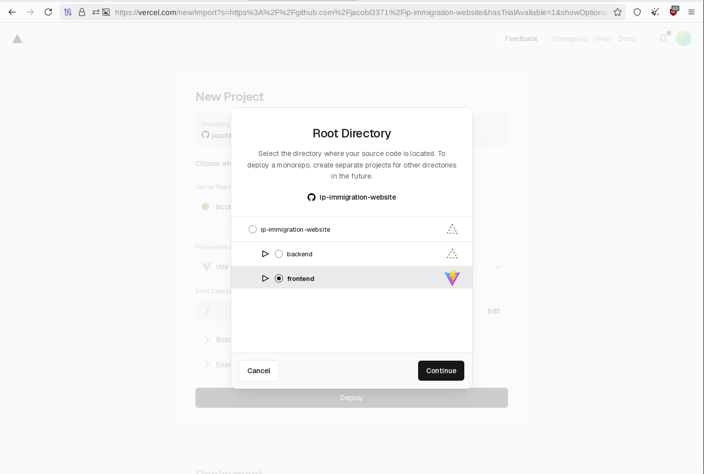

# Entry 5
##### 5/1/25

### Putting Together The Finishing Touches Of My MVP And Hosting The Website
* The final step in deploying the fullstack application is to add environment variables to the frontend directory in order for the deployed frontend to connect to the backend.


* This relies on the `dotenv` dependency that was already present in the backend to host that directory on Vercel (allowing for the route that is accessed by appending the '/api/fetchlanguage' endpoint to the url for the app deployed from the backend) except now that dependency, which is also present in the frontend, must be utilized in its own particular way with `Vite` which is the build tool used to deploy the frontend made with React, which like Node.js, is just a library in of itself, and requires a framework to implement in the web. For Node.js, it has, for a while, intrinsically been Express, and the same goes for React with Vite.


* Adding the environment variable (just one in this case) for the React+Vite frontend to get that data from the backend requires changing some of the routing done in the `initI18n.js` file.

```js
const VITE_BACKEND_API_URL = import.meta.env.VITE_BACKEND_API_URL
```

* A variable, `VITE_BACKEND_API_URL` must be declared on the first line after the dependency importations, with its value set to `import.meta.env.VITE_BACKEND_API_URL`. As is stated in the [Vite documentation](https://vite.dev/guide/env-and-mode), "Vite exposes certain constants [which is why the variable is declared with `const`] under the special `import.meta.env` object. These constants are defined as global variables during development and statically replaced at build time to make tree-shaking effective." This essentially means that that the constant, in this case the data of the region/language code extracted from the user's IP address which is fetched later when the `BACKEND_API` variable which contains just the path to the API, (`/api`), and not the endpoint, (`/api/fetchlanguage`), is called; the variable being prefixed with `VITE_` so it can be exposed to the Vite-processed code, Vite only allowing this configuration to prevent accidentally leaking env variables to the client. The `_URL` suffix declares the route stored in `BACKEND_API` as the base url the app/website is being served from.

```
BACKEND_API=http://localhost:3000/api
```

* Subsequently, the route that the API is being fetched from by the frontend in that initI18n.js file must be changed from:

```js
const response = await fetch("http://localhost:3000/api/fetchlanguage")
```

to:

```js
const response = await fetch(`${VITE_BACKEND_API_URL}/fetchlanguage`)
```

On line 14 so that the `BACKEND_API` variable which contains the route to the API, (prefixed with `VITE_` and suffixed with `_URL` so that it becomes `VITE_BACKEND_API_URL`), is accessible by the frontend. It must be in this form so that ["tree-shaking"](https://en.wikipedia.org/wiki/Tree_shaking) is effective which basically means the elimination of un-executable functions, starting from the entry point; similar to the way JavaScript code is run from left to right. This is similar to the concept of lazy loading which is implemented in lines 22-24 of my `initI18n` express function (the function in of itself being exported on the last line of the file) wherein the region/language code matching the, at that point, already derived locales language code stored in the `lang` variable is only loaded and added to the i18next object if earlier (on lines 18-20), the language code was not the `us` i18n-processible locales code which was *already* loaded to the i18next resource object on line 11. You can read more about the difference in [this entry](https://stackoverflow.com/questions/75359791/tree-shaking-vs-lazy-loading#75361843).

The `VITE_BACKEND_API_URL` variable is parsed within the dollar-sign-curly-brace `${}` ES6 function which converts a JavaScript or JSON variable into a string that can be inserted into that route, which must still be appended with `/fetchlanguage` to call our API endpoint.

<!-- full changed initI18n.js file -->


* You can see in the `Environment Variables` section of the settings for the frontend-directory project hosted on Vercel that the `.env` variable is present, and it calls the same route as the backend directory project, (the original "ip-immigration-website.vercel.app" url as opposed to the new fullstack, frontend-hosted, "ip-immigration-website-frontend.vercel.app") but only with the `/api` route appended to it ("ip-immigration-website.vercel.app/api"), as the environment variable is only calling the route that exists within the file structure and must be nevertheless appended with the `/fetchlanguage` suffix to run the index.js file code of the backend api directory being called.


* And there are no special Environment Variables in the original Vercel project/deployment of just the backend directory.


* Also, the app is not hosted from the root directory as I falsely assumed before having to integrate the React and Vite aspect, but instead from that frontend directory, with Vite selected as the framework like so:




* I added many-many language translations, which I test by simply reloading the Tor circuit when accessing the deployed frontend directory of the fullstack app on Tor Browser until I get an exit node with the IP-address of the accompanying region. If no translation file for the derived region code of the client's/user's IP address (done so by our backend api) exists in our /locales directory than the language always falls back to English (`us` region code, since it doesn't matter if the IP address is actually in the United Kingdom or Australia as that will be the default fallback English language the app defaults to anyways).


* I got the region codes from [this site](https://www.science.co.il/language/Locale-codes.php).


* Originally the code for Sweden didn't work


As the locales file that the i18n library was trying to cross-reference to an existing region code in its library (and that a derived region from any IP address could actually be equal to) was set to `sv` when the actual code that existed in the i18n library for Sweden and that was derived from our API when the client accessed the application with a Swedish IP address is `se`. So since since no according .json file with the translation existed in the locales directory, the app could not be translated with `.changeLanguage(lang)`
as the language code and directory for the `lang` variable was never added to the i18n resource object as the path to the file with that 2-letter code didn't exist and the app just defaulted to the English language/us region code that already was loaded to the object.


* Apparently, there exist two region codes for Sweden particularly, both `sv` and `se`; "sv" existing under the ISO 639-1 standard for localization, with "se" being set under the ISO 3166-1 standard.


* I couldn't find any relevant search results from my query, so I turned to AI to find out if i18n was utilizing the ISO 639-1 standard or the ISO 3166-1 standard to parse the language code that it looks for in the corresponding .json locales file.


It turns out that the ISO 639-1 standard is implemented when looking for **language** codes, while the ISO 3166-1 standard is implemented when looking for .json files named with the matching **region** codes in the locales directory. I'm pretty sure the data in the i18n library for the ISO 639-1 standard is not up to date or accurate for every region, so some regions, like Sweden, can only use the ISO 3166-1 standard, which is the standard we already used for the default language of English with the United States, `us` code.

Now I was able to get all of the translations for the corresponding IP addresses and subsequent regions to work.


### EDP
My partner added some basic frontend design using React, also adding a manual translation selection feature.


For some bizarre reason, the translation only works in Tor Browser (yes, the *manual* translation feature!) and it just doesn't translate when the user clicks the other languages on any other browser at all. This was not in any ways intentional and I need to debug this when I have time so that the application works on every browser.

This frontend build also broke the automatic translation feature which was working before and that we must reincorporate for our final, above-MVP product, as I intend for the website to first *automatically* translate according to the user's detected IP address and *then* allow the user to manually set the language using the selection feature on the frontend.

The final project is accessible [here](https://ip-immigration-website-frontend.vercel.app/).

### Skills
1. Putting the finishing touches of my freedom project together, I once again greatly expanded my skills in **problem decomposition**, having to understand that the React-based frontend built with Vite required environment variables to connect the backend to the deployed Vite frontend and which do not allow the data within those variables to be exposed to the end user, as in the case of implementing something more complex with React and Vite such as an app which includes authentication, you would not want that data for *all of the users* and which allows access to the developer's-end backend to be accessible to the end-user.

2. With the way that the product ultimately turned out by this point, it really thaught me to develop a **growth mindset**, as the final product is not working *exactly* how I intended it to, with the automatic translation feature and the manual translation feature on every single browser except for Tor Browser (again not intentional...) not working; but with all of the effort I put into the freedom project and all of the complex code throughout their varying respective files that had to come together to make this seemingly simple looking online resource with a translation feature actually even work at all, I am still very proud of my work and am confident I will get *every single intended feature* to work in due time.


[Previous](entry04.md) | [Next](entry06.md)

[Home](../README.md)
