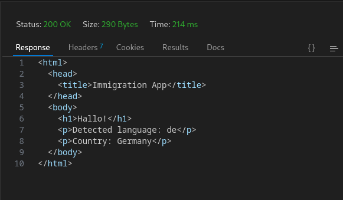
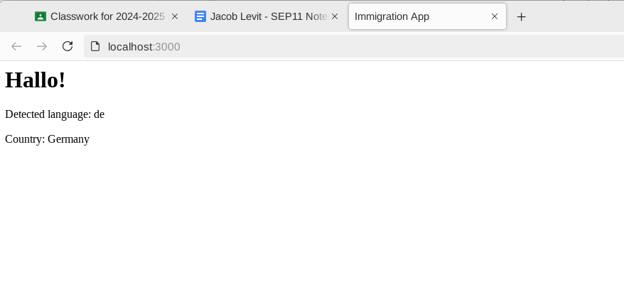
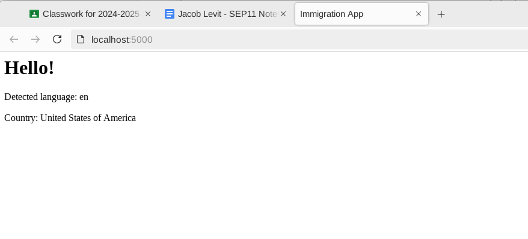
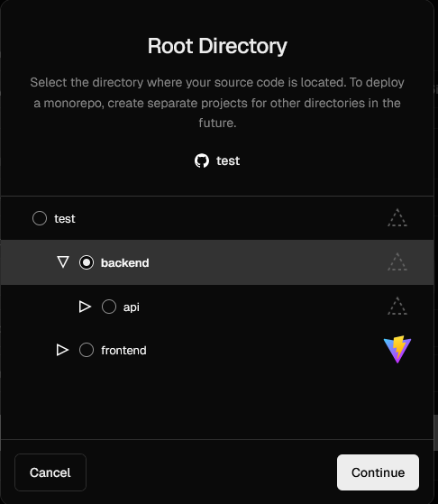
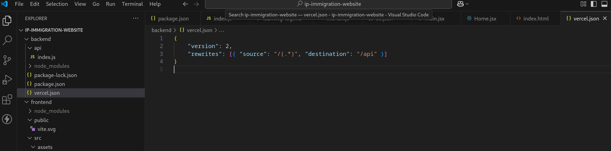

# Tool Learning Log

## Tool: **Node/Express**

## Project: **Self translating immigration website**


*10/21/2024*

We decided to use Node with Express JS to build our website which acquires the user's IP address and automatically serves the webpage content in a different language according to their detected region.

### Setting up Node with Express:

I followed [this useful tutorial for getting node and and express js setup on my desktop and in vs code.](https://www.youtube.com/watch?v=P6RZfI8KDYc) From there, me and my partner will upload our version of the files to the cs50, <i>vs code for the web</i> IDE and push our changes and pull the other partner's changes, downloading the altered files and working on them in the standalone vs code app on desktop with express setup which is reliant on node running in the operating system. This seems like the best method for now.

### Tinkering

I hadn't uploaded any of my changes yet, but my partner had already initiated an express project which we wil be using to tinker for further learning logs and when building the freedom project.

```js
{
  "name": "tinker-tool",
  "version": "1.0.0",
  "description": "",
  "main": "tinker.js",
  "scripts": {
    "devStart": "nodemon tinker.js"
  },
  "keywords": [],
  "author": "",
  "license": "ISC",
  "dependencies": {
    "express": "^4.21.1"
  },
  "devDependencies": {
    "nodemon": "^3.1.7"
  }
}
```

The following decleration/setup initiates the main file as tinker.js. I'm pretty sure that it the default process would give the file the name ```index.js```. These changes also applied to the index.html and style.css which were renamed to tinker.html and tinker.css.

```js
const express = require("express")
const app = express()

app.listen(3000)

app.get('/', (req, res) => {
    res.send("Hello World")
})
```

This is the most basic starter code in tinker.js to make the express js web api begin listening to requests made by the server. From there any changes made could be tested by going to that port in your local browser where the request in your code is being made to.


-----------------------------------------------------------------------------------

*10/28/2024*

I decided to set up express.js in my cs50 IDE for efficiency. I created a folder named ```tool-tinker2``` and followed the express.js documentation to set up a package.json file in that directory using ```npm init```.

I set up the "hello world" app from the express documentation in my index.js file and changed "hello world" to "tool tinker" and the console.log message to "tool tinker app".

I ran the app with ```node index.js``` and my terminal retrieved the message, ```Tool tinker app 3000``` since it is referring to port 3000.

I now fully understand how to set up an express app in cs50 or any development environment and run a simple app.


-----------------------------------------------------------------------------------

*11/4/2024*

I followed the [Express static files guide](https://expressjs.com/en/starter/static-files.html) and tried to change some of the files that would be served to the user.

I inputted the code

```js
express.static(root, [options])
```

into my index.js Express application and with this code

```js
app.use(express.static('public'))
```

I changed "public" to "temp", the directory in which I had my staic files that I wanted to serve.

When trying to run my index.js app I got error:

```
express.static(root, [options])
               ^

ReferenceError: root is not defined
```

I tried to change ```root``` to my workspaces directory, but then the terminal just retreived the message that "workspaces is not defined".

```
express.static(workspaces/js/projects/sep11-freedom-project/tool/tool-tinker2/ [options])
               ^

ReferenceError: workspaces is not defined
```

I still have to figure out this issue.


-----------------------------------------------------------------------------------

*11/12/2024*

I followed the [medium.com guide](https://medium.com/weekly-webtips/nodejs-internationalization-simplified-serve-one-web-page-in-multiple-languages-with-pagepress-f8e2640682cf) to make my express app have multilanguage routes using pagepress.

I set up the "Hello World!" page-press language router file itself in the frontend folder and put all of the server logic inside the express index.js file in the backend directory.

I used the placeholder method in PagePress to have the same placeholder ```@greetText``` be assigned to the word for "Hello" in different langauges, having PagePress look for the the text in the language of the according placeholder/value bindings

```js
{
    "en":{
        "@greetText":"Hello!"
    },
    "si":{
        "@greetText":"ආයුබෝවන්"
    }
}
```

I added a value for the Spanish language

```js
{
    "en":{
        "@greetText":"Hello!"
    },
    "si":{
        "@greetText":"ආයුබෝවන්"
    }
    "es":{
        "@greetTest":"¡Hola!"
    }
}
```

And I of course had to update my index.js file with the homepage request route for Spanish.

```js
// Spanish home page request
app.get('/es', (req, res) => {

    // render new page from index.html
    res.render(
        __dirname + '/index.html', // template
        {},                        // no placeholder bindings
        'es'                       // language code
    )

})
```


++Skills: how to google/research to find the right article for the pagepress setup


-----------------------------------------------------------------------------------

*12/20/2024*

I remitigated my express app setup to debian in order to test the localhost output by running ```node index.js```.


I compressed my entire tool folder directory stored locally on my machine into a .zip file to transfer to the cs50 Github IDE.

Since localhost didn't work at first I thought it was a problem with Mullvad browser, and then Firefox when I downloaded it to test the local host server, but upon correcting the index.js code to listen to the port assigned to the ```port``` value (3000) by changing this code to have the app listen to the value that port is set to instead of 80, like in the tutorial,

```js
// start the server
app.listen(80)
```

```js
// start the server
app.listen(port)
```

I was able to get the server working and on Mullvad browser, so I don't have to use any different browsers in my setup, which is good.

I changed the Sinalese language route to Chinese since the characters weren't rendering in vs code, and though the Chinese characters registered in vs code, I expereinced a similar with the actual output, which seems to fail to render any non-latin characters.

The English route output looks like this:


The Spanish route output like this:


But then the Chinese route output looks like so:


-----------------------------------------------------------------------------------

*1/13/2025*

I watched [this video](https://youtu.be/-MTSQjw5DrM?si=yi0hcy4zIXHYarTp) on REST APIs and learned how to configure a post request like so

```js
app.post('/lang/:region/', (req, res) => {

    const { region } = req.params
    const { language } = req.body

    if (!language) {
        return res.status(418).send({ message: "No language inputted" })
    }

    res.send({
        language: `${language}`, region: `${region}`,
    })

})
```

Which allows the user to input the language to be set via a post request which replaces the language value with the user's inputted language when the post request is sent


And for the URL for the Netherlands-region version of the website, the corresponding language to be set by the post request would be Dutch.


POST APIs will be an essential part of my application as a POST API end-route will be used in conjunction with a get GET API route to automatically scan for and retrieve the user's IP address and then send that data to the POST API end-route
which will post the content on the webpage in a different language according to the country/region (and subsequent language assigned in a separate variable) which their IP address corresponds to.

Simple 1-dimensional JavaScript objects will used to acheive this static automatic assignment of IP address to region, or perhaps 2d objects can be utilized to assign the language for each given region.


-----------------------------------------------------------------------------------

*3/9/2025*

* I scrapped my temporary pagepress language route setup in (most likely permanent) favor of one that *just* uses the i18n-internationalization dependancy which I installed to the new express-app directory within my tool folder by running:

```bash
npm install i18n-next
```

and

```bash
npm install i18n-next-http-middleware
```

Which generated a package.json file in the ip-immigration app directory that looks like so:

```json
{
  "dependencies": {
    "express": "^4.21.2",
    "i18next": "^24.2.2",
    "i18next-http-middleware": "^3.7.1"
  },
  "name": "ip-immigration-app",
  "version": "1.0.0",
  "main": "index.js",
  "scripts": {
    "test": "echo \"Error: no test specified\" && exit 1"
  },
  "author": "",
  "license": "ISC",
  "description": "",
}
```
containing the subsequent internationalization and internationalization-middleware dependancies.

* middleware: code that runs between the time the request is received by the server and it sends out a response to the client
    * https://www.youtube.com/watch?v=lY6icfhap2o

* Then I had to import all of the dependancies from the package.json file,

```js
import express from "express"
import i18next from "i18next"
import middleware from "i18next-http-middleware"
import fs from "fs"
import path from "path"
import { fileURLToPath } from "url"
```

Select and store my index.js file for my backend API in a variable named ```__filename```,

```js
const __filename = fileURLToPath(import.meta.url)
```

store the directory-path to the index.js file assigned to it's respetive variable in another variable (```__dirname```),

```js
const __dirname = path.dirname(__filename)
```

and then create a ```localesDir``` variable which stores the combined path of the directory (```__dirname```) and the locales directory within the same backend folder that has each language.json file (i.e: de.json, en.json...) which dynamically sets the countryCode parameter of the geoLocation paramter (stored for readability within the ``data`` variable later in the code) of the ```req``` object to a different region, middleware allowing for that code to be run *before* the server sends the client back a response (```res```), which subsequently alters the request so that the corresponsing response is sent back to the user depending on the data being used to alter the request, which in this case, though for now only simulated with a manually inputted ip-address, depends on data derived from the user when they **request** the web application from the server upon their computer trying to fetch and load the data from the website.

* Next we declare our app as express *after* the above lines of code to import all of the dependancies and select and join the file-path directories

```js
const app = express()
```

Store all of the regions within a language array

```js
const languages = ["en", "es", "de"]
```

Create an empty resources object to store all of the data from the language files in th elocal directory

```js
const resources = {}
```

And create a .forEach loop to append everything from the locales directory to the resources object.

```js
languages.forEach((lang) => {
  const filePath = path.join(localesDir, `${lang}.json`)
  const content = fs.readFileSync(filePath, "utf8")
  resources[lang] = JSON.parse(content)
});
```

Then i18next must be configured by adding the resources object to it:

```js
i18next.use(middleware.LanguageDetector).init({
  preload: ["en", "es", "de"],
  fallbackLng: "en",
  resources,
});
```

And then we must add the i18next middleware to the express server.

```js
app.use(
  middleware.handle(i18next, {
    removeLngFromUrl: false,
  })
);
```


-----------------------------------------------------------------------------------

*3/10/2025*

* In the following app.use async function for adding the region language code detector middleware to the express server, we must first manually set a hardcoded ip-address for testing on the localhost computer server which does not connect to the internet and can not query dynamic ip-addresses.

```js
const ip = "101.33.11.255"
```

* Next, there is code to check if the ip address is localhost (127.0.0.1) in which the calling of the ip-address api is skipped by calling the next() function after ```return``` to skip the middleware.

```js
if (ip === "127.0.0.1" || ip === "::1") {
    return next()
}
```

* Then we make a call to the freeipapi.com ip-address JSON api, storing it within the ```apiUrl``` variable which is then stored within the ```response``` vsriable which fetches ```apiUrl``` and then uses the ```await``` Javascript promise to only fetch this data once the other middleware finishes running.

```js
const apiUrl = `https://freeipapi.com/api/json/${ip}`;
const response = await fetch(apiUrl)
```

* If the api call fails, meaning that the response is not equal to .ok (coded in the syntax ```!response.ok```) then we throw a new a error which sends the message

```js
`API responded with status ${response.status}`
```

The ```${response.status}``` JSON object being equal to the *status* of the response (200: ok, 400: server-error, etc.).

```js
if (!response.ok) {
    throw new Error(`API responded with status ${response.status}`)
}
```

* The next step is to store the ```response``` variable with the freeipapi.com API in a separate variable (```data```) which coverts ```response``` to JavaScript Object Notation (JSON).

```js
const data = await response.json()
```

* Then we set the ```.geoLocation ``` property of the ```req``` object to the data ```response.json()``` variable which uses ```await``` to ensure it only runs after the eother middleware (so that the code waits for the server to finish parsing the request user-data before altering that data to produce a subsequently altered response).

```js
req.geoLocation = data
```

* Then create an object with references to the language code of each JSON file in the ```locales``` directory, using built-in JSON and i18n syntax to assign each lowercase string language file "en, es and de" to their respective JSON, node.js i18n capital-case country code.

```js
const countryToLanguage = {
    US: "en",
    ES: "es",
    DE: "de",
}
```

* The below code checks if *there even is* a country code and detected language in which it sets the language code of the ```req``` object to the given language of the region by calling the rough geolocation which with the ```.countryCode``` property appended to it, constitutes a given region which then has the language that is ultimately being derived to set ```req.language``` to, as objects and arrays in Javascript have prebuilt functions behind them that allow them to select other objects, strings or variables, passing them through and checking those values with ones within the object or array to derive a single value to be used.

```js
if (data.countryCode && countryToLanguage[data.countryCode]) {
    req.language = countryToLanguage[data.countryCode]
    req.i18n.changeLanguage(req.language)
}
```

```js
req.i18n.changeLanguage(req.language)
```

The ```changeLanguage``` method of the i18n ```req``` object property acts as a function which takes in the the ```req.langauge``` variable/recently-altered-object-property as parameter for the behind-the-scneses built in i18n-internationalization code to set the language to that of the ```req.langauge``` variable which rectroactively depends on the user's ip-address and region.

* It is important to remember to call the ```next()``` function aftwerward to end this middleware which get's the user's ip address, (checked with running servers provided via the freeipapi-API) converts it to a JSON object and stores that within the global ```data``` variable which the the geoLocation parameter of the ```req``` object (```req.geoLocation```) is set to; utilizing that and the ```countryToLanguage``` object to derive the request-object language and use the ```changeLanguage()``` method to change the language of the dynamically-updated i18n JSON object-strings according to the given language.

```js
next()
```

The code to detect the user's ip-address, derive the region, and set the according language must stop running before the ```catch``` error-handling promise-object runs to catch any rejected values within the ```try``` promise-object, and run in the console that there was an error detecting the user's location.

```js
catch (error) {
    console.error("Error detecting location:", error.message)
    next()
}
```

That middleware also having to be resolved with the ```next()``` function called after that code to console.error the error message.

* Fully formatted app.get function for getting the user's ip address and setting the language according to their region:

```js
app.use(async (req, res, next) => {
    try {
        const ip = "45.14.233.209"

        if (ip === "127.0.0.1" || ip === "::1") {
            return next()
        }

        const apiUrl = `https://freeipapi.com/api/json/${ip}`
        const response = await fetch(apiUrl)
        if (!response.ok) {
            throw new Error(`API responded with status ${response.status}`)
        }
        const data = await response.json()
        req.geoLocation = data

        const countryToLanguage = {
            US: "en",
            ES: "es",
            DE: "de",
        }

        if (data.countryCode && countryToLanguage[data.countryCode]) {
            req.language = countryToLanguage[data.countryCode]
            req.i18n.changeLanguage(req.language)
        }
        next()
    } catch (error) {
        console.error("Error detecting location:", error.message)
        next()
    }
})
```

* Lastly the application must send a **response** back to the user in the form an html page with the dynamically updated ```req``` body objects whose values are derived from the previous code,

```js
app.get("/", (req, res) => {
    const welcomeMessage = req.t("hello")
    res.send(`
        <html>
            <head>
                <title>Immigration App</title>
            </head>
            <body>
                <h1>${welcomeMessage}</h1>
                <p>Detected language: ${req.language || "Not detected"}</p>
                <p>Country: ${req.geoLocation?.countryName || "Unknown"}</p>
            </body>
        </html>
    `)
})
```

The ```welcomeMessage``` gets dynamically updated with the value of the request message which has that text translated (in this case just "hello") to the translation or .t(), a nodejs and specifically i18n method that can be applied to the request object with that text passed through which is crossed referenced to the exact same text in the JSON file that the previous code determines to use, ```"translation"``` being a global operator / method in node.js, i18n and JSON, which is called with req.t().

```json
{
    "translation": {
        "hello": "Hallo!"
    }
}
```

```js
const welcomeMessage = req.t("hello");
```

* For simplicity I coded the html directly in my Javascript-express file, but I must learn a templating language to connect an html file with my content, css, and frontend user-interactivity Javascript once I have my site hosted in which it will have connection to the internet and dynamically updated ip-addreses (meaning I have to change the code to not hard code it but use the ```req.ip``` object-property) instead of being hosted locally on my computer or on the cs50 github IDE port.

-Since I am building the application locally using vs code and uploading a compressed .zip file of my tool folder to my IDE which I then unzip after deleting the previous directory, the port that the application listens to must be declared at the very end of the file.

```js
app.listen(3000)
```

Thunder client produces a response when a GET request is made on the locahost port with the exact same raw html which isnested within the response of the app.get route, just with the values updated.



The last app.get() operator is a route and not just a function since it has the "/", directory before the (req, res) object parameters, so in this case the app will direct to localhost:3000, or whatever port the app is set to listen for.

Webpage with Germany ip address applied:


Webpage with United States ip address applied:



-----------------------------------------------------------------------------------
*3/22/2025*

* I made a new repository for the freedom project named `ip-immigration-website` which is for convenience and best practices, separate from the sep11-freedom-project repo.
    * This was due to us having to make a new repo from scratch for the app/website once again as my partner had been learning react so we had to incorporate the required dependancies for react and express and i18next into our app, and also to not have to remove anything else in the old `ip-immigration-app` app-directory (which is in the tool folder of the sep11-freedom-project repo) that may have caused the new fullstack setup to not work.
* We had to install dependancies like [cors](https://expressjs.com/en/resources/middleware/cors.html) which allows for my nodejs+express backend to be linked to my partner's react frontend.

```bash
npm install cors
```

and `dotenv`

```bash
npm install dotenv
```

* As well as the `i18next` and `i18next-http-middleware` dependancies which the freedom project already relied on for translation with node.js solely.

* [This article]("https://www.stackhawk.com/blog/react-cors-guide-what-it-is-and-how-to-enable-it/") goes into depth on `cors`, which stands for cross-origin resource sharing.

* The `back-end` package.json file at this point contained the following dependencies:

```json
{
    "dependencies": {
        "cors": "^2.8.5",
        "dotenv": "^16.4.7",
        "express": "^4.21.2",
        "i18next": "^24.2.2",
        "i18next-http-middleware": "^3.7.1"
    },
}
```

* Next we have to import the `express` and `cors` dependancies into our `index.js` file in our back-end like so:

```js
import express from "express"
import cors from "cors"
```

* I have that file stored in a folder named `api` as the index.js file acts as it's own API when called by this line of code in the front-end `initI18n.js` file, and also when the hosted vercel application is run `"https://ip-immigration-website.vercel.app/api/fetchlanguage"` (**but this only works if the `backend` directory is selected when hosting the app):

```js
const response = await fetch("http://localhost:3000/api/fetchlanguage")
```

-The `api/fetchlanguage` route leading to a response with the JSON data of the two-letter country code.

* Then the app is set to `express()` as usual.

```js
const app = express()
```

* But we also must create an `app.use()` function to use the `cors` cross-origin resource sharing dependancy:

```js
app.use(cors())
```

* The following `app.get()` function produces a response using the specified request parameter (the ip address) which has the two-letter country-code (which is to later match a .json file in the locales directory in the front-end) that can be correlated to an existing language for the app to pick amongst when translating itself as that .json language file becomes added to the i18next resource bundle.

```js
app.get("/api/fetchlanguage", async (req, res) => {})
```

* We can view this pure JSON API response by visiting the "/api/fetchlanguage" directory route endpoint by simply adding that endpoint route to the end of our URL that points to the backend directory of our app hosted on vercel (need to make sure to select the backend to host).



```js
const ip = req.headers["x-forwarded-for"]
```

* This variable stores the dynamically updated ip address in the `ip` variable, and we use `req.headers["x-forwarded-for"]` which looks for the ip address in the request headers. The user's ip address connecting to the server is marked under the name `"x-forwarded-for"`, it just isn't shown in the displayed headers, but this is similar to the `x-powered-by` and `x-vercel-cache` request headers; the `"X-"` prefix present in every header which provide vendor-specific (in this case vercel) information not universally accessible by http, and/or custom information specific to the api (the client's ip address), which must be differentiated from the standard http headers to avoid any naming conflicts.



```js
 if (ip === "127.0.0.1" || ip === "::1") {
    return next()
}
```

* This code stays the same as the API is still intended to skip loading the app.use() function to get the JSON language/country-code from the ip-address if that returned ip-address is just the localhost and not an ip address that could be derived from connecting to the application on an internet-connected web server (either local or on the vercel app) and not just on the computer's ip address which doesn't connect to the internet.

```js
const apiUrl = `https://freeipapi.com/api/json/${ip}`
```

The ip address stored in the `ip` variable is applied to the freeipapi.com API, with the "api/json" suffix to retreive the JSON language/country-code data based on the inputted ip address which the freeipapi.com API database can correlate to an existing region and subsequent country-code.

```js
const response = await fetch(apiUrl)
```

That response is then stored within a variable named `response` which awaits for the promise of fetching the `apiUrl` to be met, which is to return the country-code based on the inputted ip-address, upon which it moves on to the next code of using that `response` variable, but not before, of course, like I had it in my old code, checking if that response produces an `ok` status, and if not throwing a new error.

```js
if (!response.ok) {
    throw new Error(`API responded with status ${response.status}`)
}
```

Then the `data` variable holds the .json JSON output of the response, and it uses await to have app.use async function only move on to the next code the promise of getting the `response.json` is fulfilled.

```js
const data = await response.json()
```

Finnaly the last line of the `try{}` in our async function returns the output with the response containing the pure JSON data of the "language" followed by a two letter country code derived from appending the `.countryCode.toLowerCase()` property to our `data` variable.

```js
return res.json({ language: data.countryCode.toLowerCase()})
```

And the output looks precisely like so:


After that we have a `catch{}` block to catch and `console.error` any errors in getting the country-code from the ip address.

```js
catch (error) {
    return res.json({ error: error.message })
}
```

The entire async/await `app.get` function is formatted like so:

```js
app.get("/api/fetchlanguage", async (req, res) => {
    try {
        const ip = req.headers["x-forwarded-for"]

        if (ip === "127.0.0.1" || ip === "::1") {
            return next()
        }

        const apiUrl = `https://freeipapi.com/api/json/${ip}`
        const response = await fetch(apiUrl)
        if (!response.ok) {
            throw new Error(`API responded with status ${response.status}`)
        }
        const data = await response.json()
        return res.json({ language: data.countryCode.toLowerCase()})
    }
    catch (error) {
        return res.json({ error: error.message })
    }
})
```

Next the express app has to listen for port 3000, unlike 5000 the way I had it earlier as this is specific to Vercel.

```js
app.listen(3000)
```

And the app has to exported like so on the very last line to be rendered by `initI18n.js` that will use the code from this file:

```js
export default app
```

We also need to have a `vercel.json` file in our backend directory which holds the appropriate dependancies to allow for out backend to be hosted to Vercel.


And lastly this start script must be incorporated into the back-end package.json file otherwise the app won't run on either server:

```json
"scripts": {
    "start": "node index.js"
},
```

Now when we visit the `"/api/fetchlanguage"` route of the ip-immigration-website.vercel.app website we get the pure JSON response of the detected country-code, which retroactively updates according to the ip address which can be changed by reloading the tor circuit in tor browser, the country-code automatically changing once the detected ip address changes!


-----------------------------------------------------------------------------------
*3/31/2025*

* Now with the backend API done we have to send this data to the frontend so that the user can see the translated text.

* After importing these dependencies in the `init18n.js` frontend file for `i18next` and `react-18next` like so

```js
import i18next from "i18next"
import { initReactI18next } from "react-i18next"
```

* Into variables that hold those dependencies, (those variable-names could be anything that the a developer sets), we have to import the fallback language into a variable named `defaultLang`

```js
import defaultLang from "./locales/us.json"
```

* Next the app runs this `initI18n` function

```js
const initI18n = async () => {}
```

Which is an `async` function that allows any code which is, (on that line), declared with `await` and run within a `try{}` block nested in that async function to make it so that the code after that line declared with await will only run if the given promise is met, otherwise it automatically skips the code that is after the line of code declared with await and runs the code in the `catch{}` block which returns an error message.

```js
catch (e) {
    console.error(e)
}
```

Before the `try{}` block in the async function the default fall-back language must be set to apply that json region code and subsequent translated text of that .json file if translations in the user's language are not available, meaning that the .json two-letter region file which holds the translated text is not present in our /locales directory. Deriving the region/language file to use must also only be done later in the try{} block as await needs to be used to actually get the json region code (since our API may or may not fail eventually) and to import that .json file from the locales directory (it may or may not exist depending on if I had created a locale file for that region and subsequent language).

```js
i18next.use(initReactI18next).init({
    fallbackLng: "us"
})
```

Nevertheless *that fallback language* which is being set in the .init function to initialize the i18next module with the declared fallback language (`fallbackLng`) must already be loaded to the i18next resource object. We can not use `i18next` methods without first initializing the i18next module which uses the `.use()` method to use the `initReactI18next` variable which had the `react-i18next` dependency from our frontend package.json file imported to it.

```js
i18next.addResourceBundle("us", "translation", defaultLang)
```

That `.addResourceBundle()` method for `i18next` is a resource object which the i18n library has that can store multiple objects and each object will store the different translated text of the .json file in the /locales directory which is being added to the i18n resource object.

* The `try{}` block contains, nested within it, code that runs promises to get data from the backend file code (which is all within an `app.get` function in that index.js backend file that takes in various request parameters stored within the `req` object and uses those parameters such as the ip address derived from `req.headers["x-forwarded-for"]` to return a response when the "/api/fetchlanguage" endpoint is called) which takes time to get (it takes time by default and even more so if that API accessed via the api/fetchlanguage endpoint is calling another api (`await fetch ...`) to get the data it needs for just its API response) and may or may not be fulfilled, (which is why we need to implement error handling in the following catch{} block.)

```js
const response = await fetch("http://localhost:3000/api/fetchlanguage")
```

* Since the `app` (express) was set to *be listened for* on port 3000 that is the port that contains the index.js api-directory, backend-directory code (which running on localhost:3000 is technically an app in of itself with the express backedn code that is to be used by the react frontend code in our initI18n.js file) that is then accessed on the /api/fetchlangage endpoint where the get request with all of the backend code, and the subsequent response (the json two-letter region value) is sent to.

* Even though in the index.js file app.get function for the /api/fetchlanguage endpoint that two-letter region `countryCode` is sent as a response with the `res.json({})` `.json({})` parsing method, that response only remains in JSON form when the /api/fetchlanguage endpoint is called on the vercel-hosted app, so that response variable with the region code must be converted from a string to JSON and stored in another variable that we'll call `data`.

```js
const data = await response.json()
```

* That `data` variable must be appended with the `.region` property and stored within another variable, `lang` (we call it "lang" even though it is *actually the region* since this is more convenient to remember since the data within that variable is ultimately used to get the language to translate the content to) so that i18n can process that two-letter country code as an actual region to then match to an existing locales directory file when being added to the i18next resource bundle object.

```js
const lang = data.region
```

* I also had to change this code in my `index.js` file within the `api` directory of my `backend` directory:

```js
if (ip === "127.0.0.1" || ip === "::1") {
    return next()
}
```

So that instead of returning `next()` which would break the app as the app.get function does not use any middleware and does not have the `next` parameter which can be called, the application simply returns the JSON with the default, fallback region if the detected ip address is "127.0.0.1", indicating that the user is on their localhost ip address.

```js
if (ip === "127.0.0.1" || ip === "::1") {
    return res.json({ region: us})
}
```

* After the code to set the `lang` variable to the `.region` property of the `data` variable which holds the JSON response (parsed with `response.json()`), we must check if that `lang` variable is equal to the default and fallback region we already have set, in which case the entire async function is returned and the rest of the code to look for the JSON file depending the value of `lang` is not run.

```js
if(lang==="us"){
    return
}
```

* To handle every other case where the user's detected region that's derived earlier from our API is not equivalent to the default and fallback region, we need to declare a variable, that I have named `module` to represent the given language module that uses the await pre-declaration/function once again within the try{} block of our async function to await the importing of the file which matches that given `lang` variable within the locales directory, being parsed with `${}` to convert the JSON stored in the `lang` variable *back* to a string to complete the route to the .json file from which to import the translated text from.

```js
const module = await import(`./locales/${lang}.json`)
```

This acts the same way as when we originally added the .json locales directory route for the fallback language to the i18next resource object which was stored within that `defaultLang` variable.

```js
import defaultLang from "./locales/us.json"
```

```js
i18next.addResourceBundle("us", "translation", defaultLang)
```

So then the next line of code must add that language route derived from the `lang` variable and the region (that variable itself) to the i18next resource object so then that region can be used to set the language in the line of code *after that*.

```js
i18next.addResourceBundle(lang, "translation", module.default || module)
```

That route with the given `locales/.json` file is stored within the `module` variable. The module.default just gets the default export of that file. Default export is just the main export of a file. A file could have many exports and one main default export. The `|| module` declaration after just make sure that if there isn't a default export we will just get the whole file with everything.

And finally we change the language using the `.changeLanguage()` function to that of the corresponding region which already has the path to it's .json file and the translated text within it.

```js
i18next.changeLanguage(lang)
```

* The entire `initI18n` async function to set the language from files in the locales directory according to the detected region derived from fetching the backend API is structured like so:

```js
const initI18n = async () => {
    i18next.use(initReactI18next).init({
        fallbackLng: "us"
    })
    i18next.addResourceBundle("us", "translation", defaultLang)

    try {
        const response = await fetch("http://localhost:3000/api/fetchlanguage")
        const data = await response.json()
        const lang = data.region

        if(lang==="us"){
            return
        }

        const module = await import(`./locales/${lang}.json`)
        i18next.addResourceBundle(lang, "translation", module.default || module)
        i18next.changeLanguage(lang)

    } catch (e) {
        console.error(e)
    }
}
```

* And once again all of the code run within the app/function/variable of that file must be exported so that it can be accessed by other files (from here on the react .jsx files).

```js
export default initI18n
```

* Finally to put together the fullstack app we need to update the text of the HTML returned within the react frontend to the language set previously according to the user's region which was done in the initI18n.js file on the last line of the try{} block of the async function where the language was changed to the language of the region using `.changeLanguage`.

```js
import { useTranslation } from "react-i18next"

const Home = () => {
  const { t } = useTranslation();
  return (
    <div>
        <h1>{t("hello")}</h1>
    </div>
  )
}
```

* Since the `useTranslation` variable (which is a pre-existing hook in react) is imported from "react-i18next" and all of its dependencies, the `.changeLanguage` method allows us to change the language object in the `useTranslation` hook, and then the `t` function/variable which is set to the useTranslation hook has access to that language object, and translates the given key/key-name passed through the `t()` function (in this case "hello") to the translation of that given key in the .json locales directory file which was selected on `line 20` of the `initI18n.js` file, added to the i18next resource object on `line 21` and has the language object set to the language of the given region with the `.changeLanguage()` function on `line 22`.

Then it will return the translated text for the corresponding key in that .json file.

```json
{
"hello": "Hallo!"
}
```

* And lastly this function must also be exported.

```js
export default Home
```

* [This article](https://www.i18next.com/overview/api) helped me to better understand the use of i18next with react and the deployment of the `getTranslation` react hook and `t` function to translate the text according to the set region for i18next.


