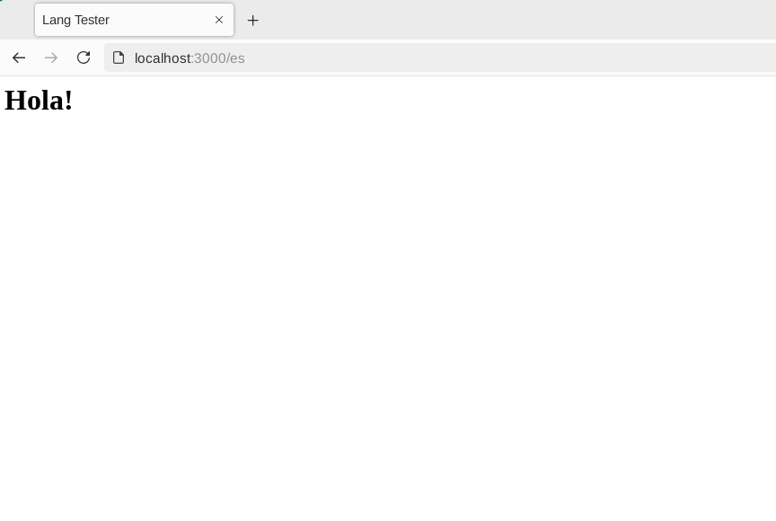
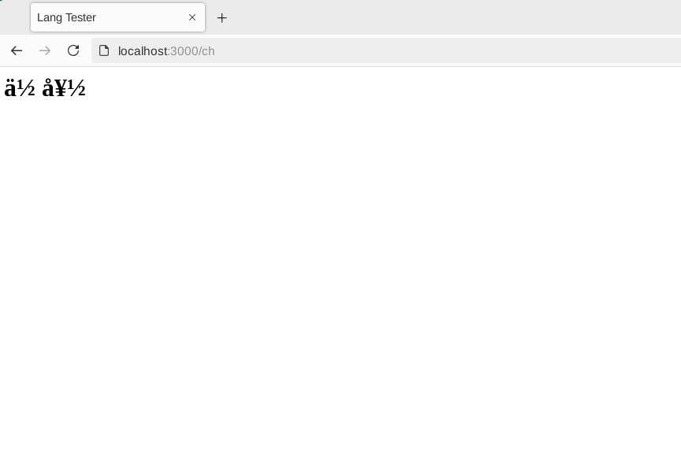

# Tool Learning Log

## Tool: **Node/Express**

## Project: **Self translating immigration website**


*10/21/2024*

We decided to use Node with Express JS to build our website which acquires the user's IP address and automatically serves the webpage content in a different language according to their detected region.

### Setting up Node with Express:

I followed [this useful tutorial for getting node and and express js setup on my desktop and in vs code.](https://www.youtube.com/watch?v=P6RZfI8KDYc) From there, me and my partner will upload our version of the files to the cs50, <i>vs code for the web</i> IDE and push our changes and pull the other partner's changes, downloading the altered files and working on them in the standalone vs code app on desktop with express setup which is reliant on node running in the operating system. This seems like the best method for now.

### Tinkering

I hadn't uploaded any of my changes yet, but my partner had already initiated an express project which we wil be using to tinker for further learning logs and when building the freedom project.

```js
{
  "name": "tinker-tool",
  "version": "1.0.0",
  "description": "",
  "main": "tinker.js",
  "scripts": {
    "devStart": "nodemon tinker.js"
  },
  "keywords": [],
  "author": "",
  "license": "ISC",
  "dependencies": {
    "express": "^4.21.1"
  },
  "devDependencies": {
    "nodemon": "^3.1.7"
  }
}
```

The following decleration/setup initiates the main file as tinker.js. I'm pretty sure that it the default process would give the file the name ```index.js```. These changes also applied to the index.html and style.css which were renamed to tinker.html and tinker.css.

```js
const express = require("express")
const app = express()

app.listen(3000)

app.get('/', (req, res) => {
    res.send("Hello World")
})
```

This is the most basic starter code in tinker.js to make the express js web api begin listening to requests made by the server. From there any changes made could be tested by going to that port in your local browser where the request in your code is being made to.


-----------------------------------------------------------------------------------

*10/28/2024*

I decided to set up express.js in my cs50 IDE for efficiency. I created a folder named ```tool-tinker2``` and followed the express.js documentation to set up a package.json file in that directory using ```npm init```.

I set up the "hello world" app from the express documentation in my index.js file and changed "hello world" to "tool tinker" and the console.log message to "tool tinker app".

I ran the app with ```node index.js``` and my terminal retrieved the message, ```Tool tinker app 3000``` since it is referring to port 3000.

I now fully understand how to set up an express app in cs50 or any development environment and run a simple app.


-----------------------------------------------------------------------------------

*11/4/2024*

I followed the [Express static files guide](https://expressjs.com/en/starter/static-files.html) and tried to change some of the files that would be served to the user.

I inputted the code

```js
express.static(root, [options])
```

into my index.js Express application and with this code

```js
app.use(express.static('public'))
```

I changed "public" to "temp", the directory in which I had my staic files that I wanted to serve.

When trying to run my index.js app I got error:

```
express.static(root, [options])
               ^

ReferenceError: root is not defined
```

I tried to change ```root``` to my workspaces directory, but then the terminal just retreived the message that "workspaces is not defined".

```
express.static(workspaces/js/projects/sep11-freedom-project/tool/tool-tinker2/ [options])
               ^

ReferenceError: workspaces is not defined
```

I still have to figure out this issue.


-----------------------------------------------------------------------------------

*11/12/2024*

I followed the [medium.com guide](https://medium.com/weekly-webtips/nodejs-internationalization-simplified-serve-one-web-page-in-multiple-languages-with-pagepress-f8e2640682cf) to make my express app have multilanguage routes using pagepress.

I set up the "Hello World!" page-press language router file itself in the frontend folder and put all of the server logic inside the express index.js file in the backend directory.

I used the placeholder method in PagePress to have the same placeholder ```@greetText``` be assigned to the word for "Hello" in different langauges, having PagePress look for the the text in the language of the according placeholder/value bindings

```js
{
    "en":{
        "@greetText":"Hello!"
    },
    "si":{
        "@greetText":"ආයුබෝවන්"
    }
}
```

I added a value for the Spanish language

```js
{
    "en":{
        "@greetText":"Hello!"
    },
    "si":{
        "@greetText":"ආයුබෝවන්"
    }
    "es":{
        "@greetTest":"¡Hola!"
    }
}
```

And I of course had to update my index.js file with the homepage request route for Spanish.

```js
// Spanish home page request
app.get('/es', (req, res) => {

    // render new page from index.html
    res.render(
        __dirname + '/index.html', // template
        {},                        // no placeholder bindings
        'es'                       // language code
    )

})
```


++Skills: how to google/research to find the right article for the pagepress setup


-----------------------------------------------------------------------------------

*12/20/2024*

I remitigated my express app setup to debian in order to test the localhost output by running ```node index.js```.

I compressed my entire tool folder directory stored locally on my machine into a .zip file to transfer to the cs50 Github IDE.

Since localhost didn't work at first I thought it was a problem with Mullvad browser, and then Firefox when I downloaded it to test the local host server, but upon correcting the index.js code to listen to the port assigned to the ```port``` value (3000) by changing this code to have the app listen to the value that port is set to instead of 80, like in the tutorial,

```js
// start the server
app.listen(80)
```

```js
// start the server
app.listen(port)
```

I was able to get the server working and on Mullvad browser, so I don't have to use any different browsers in my setup, which is good.

I changed the Sinalese language route to Chinese since the characters weren't rendering in vs code, and though the Chinese characters registered in vs code, I expereinced a similar with the actual output, which seems to fail to render any non-latin characters.

The English route output looks like this:


The Spanish route output like this:


But then the Chinese route output looks like so:

